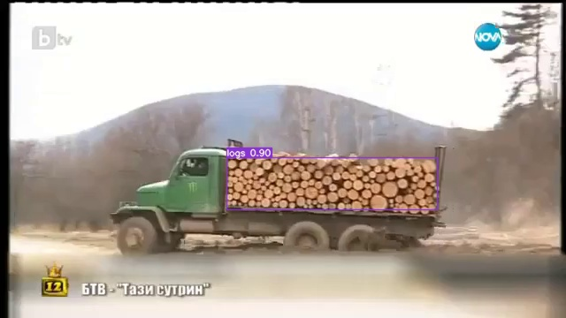
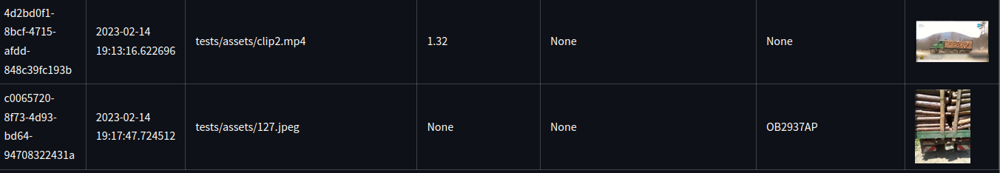

# Detection of stacked logs and Bulgarian license plate recognition


I created this small app to help process long video files in search of logging trucks. Ideally this would aid efforts 
to combat illegal logging. This repository includes two models which were fine-tuned by me with data collected from the 
public photo register of the [South-Western State Enterprise](https://www.fotoregister.uzdp.bg/public). 
The fine-tuned models are:
 - Object detection: [YOLOv7](https://github.com/WongKinYiu/yolov7) by Wong Kin Yiu.
 - License plate detection [IWPOD_NET](https://github.com/claudiojung/iwpod-net) by Claudio Jung.
 - License plate OCR [EasyOCR](https://github.com/JaidedAI/EasyOCR) by JadedAI

Main features of the app include:
- Writing the output to a SQLite database
- Checking for new input from a GDrive folder
- The ability to organise detections in a group of frames
- Streamlit front-end for displaying the results

Installation
------------

Install poetry:

```bash
pip install poetry
```

Clone the repository and navigate to the project directory:

```bash
poetry install
```

Configuration
-------------

Found in `src/logtrucks/settings.yaml`

Test configuration in `tests/test_settings.yaml`

```yaml
# GDrive settings
enable_gdrive_source: False
gdrive_credentials: "credentials.json" # name of credential file stored in project root
gdrive_directory: "" # id of the shared GDrive directory
download_directory: "downloads" # name of directory for tmp downloads
# Detection logic
detection_max_frame_length: 50 # how many frames a single detection can span
detection_frame_buffer: 5 # number of frames until a detection with a new id is created
results_dir: "results"
write_to_db: True
rename_lp_image: True # add predicted license plate to name of file
# Models
yolo_weights: "v1.pt"
ocr_weights: "best_acc_300k_90percent"
```

Usage
-----

Run cli examples:

```bash
poetry run logs -f tests/assets/127.jpeg

poetry run logs -f tests/assets/clip2.mp4
```

Results as seen in the Streamlit frontend:



Python:

```python
from src.logtrucks.main import DetectLogic

dl = DetectLogic()
dl.start_detections("tests/assets/clip2.mp4")
```

Streamlit Frontend
------------------

A small streamlit app is included in the repo in order to visualise the contents of the SQLite database. The default 
db name is hardcoded in it. It will look for `logtrucks.db` in the project root and the default table name `detections`.

Run using:

```bash
poetry run streamlit run display_logsdb.py
```

Testing
-------

Tests are run using pytest via poetry:

```bash
poetry run pytest
```

TODO
----

- Migrate IWPOD_NET from tensorflow to pytorch
- Refactor/clean up IWPOD_NET/OCR/YOLO code
- Investigate TensorRT for faster inference
- Complete readme
- Implement logs (as in monitoring)
- docstrings
- Improve error handling